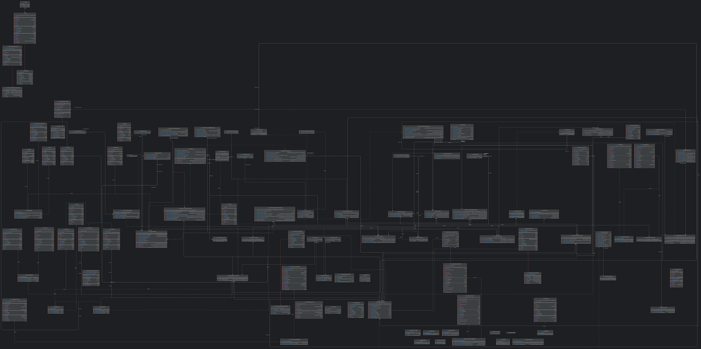

# Real-Time Event Ticketing System


&nbsp;

&nbsp;

&nbsp;

&nbsp;

&nbsp;

```shell
  _____ _    _       _   _             _   ___ ___
 |_   _(_)__| |_____| |_(_)_ _  __ _  /_\ | _ \_ _|
   | | | / _| / / -_)  _| | ' \/ _` |/ _ \|  _/| |
   |_| |_\__|_\_\___|\__|_|_||_\__, /_/ \_\_| |___|  v1.0
                               |___/
   running on Spring Boot 3.3.4
```

TicketingApp backend is a state-of-the-art solution built with Spring Boot, designed to efficiently manage ticket transactions and event data. 
Utilizing multithreading and the Producer-Consumer pattern, it ensures high performance and responsiveness. 
The system follows solid Object-Oriented Programming (OOP) principles, promoting scalability and maintainability. 
Secure JWT-based authentication and role-based access control provide distinct functionalities for admins, vendors, and customers. 
Seamlessly integrating with the frontend, it offers a dynamic, real-time experience for tracking ticket sales and managing events with precision.

[](https://mermaid.live/edit#pako:eNpVUsGO2yAU_BXr7dVxsLGxzVa9NNtTq0q7PVW-vBgco8XGArzdNMq_F5Ooq554M8O8xwAX6I2QwOFkcRmTb8-P3ZwkX62Z_dMskk-73efk8PNHZMN6I74E1RqtpY38B7zJL9K-qV5G7V7fhGe5GKe8seeofcD7HPR4RLcZN7nX6NxBDomQA67aJ4PSmj8QQlIX5r1K_kApvde730r4kZfL-yOkMEk7oRIh1mXr1IEf5SQ74KEUaF876OZr2IerNy_nuQfu7SpTWBeBXh4UhtuY_iefxHZS4ANqF0htUMgAL-DPS7w_5Xzo2Jt5UKeNX60O9Oj94vh-v8nZSflxPWa9mfZOiRGtH99atmcFa7CgktUUK0pFf8zbZijKfBA1yQuE6zWFBeet6zvwhmSkKvKGVoxWtGyqFM7Ac5LlJWN5WbZ0o1nw_DEmpCBZW7O8aauKVbRmpA4GGdN8vz19_AEpWLOexn8Bw7xf0R7x9S-eDK5R)

## *TicketingAPI Class Diagram*

[](https://github.com/anuja-rahul/ticketingApp/blob/main/diagrams/ticketingappClassDiagram.png)

## Sequence Diagram (Producer-Consumer)

[](https://mermaid.live/edit#pako:eNrtVsuO2jAU_RXLqxmJoRARFLwYqUO77AY6s6jYuLEHrEns1A_aFPHvvXkBcUKBqt01q9g-576O7esdjhXjmGDDvzkuY_5B0LWm6Uoi-GhslUbPhutqnFFtRSwyKi167-yGSxhSK5ScK2m1SpI-5GcRv3F7GbHkeiti3l1-4ZIpfXZ57oxVKb8M8NxUwCI79PD4eDYhghZ8LYwFGBTjBFV7OsfrMVq7JkjXFu_u0TtET0ze3fcZrXnooTBZBEw8wIKbTEnTTcqvPRAZq2crqI84oR3CjTWH2KrJJsIWpCS1ZCJoSxPBgFZNN7QWqErIc_ZS8aqsXGLPuetVtYm1vdg476X0BtFGzkubrDeS_ip7vIuqPLn8ZlW-uvySJN7ROIrSLPiV-YfCuIz9dWGeS5u3C_Ok3Hpjr9BlyZPkZmEMkP4r82fKLFVyOC-_v1lZKo4XqjPcXEHqVP1Knne1HVm926HYTwueKSOgfeZdePfS_LgF12DlVawPToSEBgEd2KDvwm5ulNQn4wEGUEoFg16_K4ytMOSb8hUm8MuoflvhldwDDtqRWuYyxsRqxwdYF2cFk1eaGBhVe6V-JRxmoc1-Ueo45qxI_VP1tChfGCUGkx3-gUkQjodBNI6ms1E0jaIwCgc4x2QSDmdBMA4mk3A0DWZRsB_gn6XV0TDc_wKz5wu7)

## JWT Authentication

[](https://mermaid.live/edit#pako:eNqFVFFv2jAQ_iuWnzaNQkJIAD9UmsqqblqlrrBNmngx9kGsBjuzna6s4r_PTgyFJtvygMjdfffdZ3-5Z8wUB0ywgZ8VSAYzQTeabpcSuaek2gomSiotuioESNuOf_q-eF_Z_FoUFnRneg76UTBo574a0DOwVBTmrzVzYJUWdtfOzIQpqWU5aA8uoGO2KyWtVkXRNdiMWrqixlE2uUbfxeXluzNFxE0gObpZLO7QvT8jE3jOqhzsFeoqB_bgi9BCPUDgaH5pYdGtMEbIDVIafZSPtBDc1zb5dnfXvhmPNIOMogS9uVZ6JTgH-baBQWEAfftfq0ZfOG7S1FMLrycNwFDnUe3LIuizory-RRQyL-B2uVdxccrdDTxhDYDTY230eeTpiXbKPDjHEZW1xEPAuwKe7I0q-KGNfw7pLtp5xRgYs5T_4Gv5kaA7asyxLwq8Ly1aCN_mxbMEuSv-RTU_N15t1mNRzRysTNCXCvTuxNpHphCptZ0y3IOttKzznd19fYewALsHUyp5RtSS9Nq7wyhCb8J5HpwruT9Z3MNb0FsquNtHzz61xDaHLSwxcX851Q9LvJR7V0crq-Y7yTCxuoIeruobDrvrPPiBC6s0Jmvqvo8eLpxlwb0-Y7sr_eLbCGNdR6bkWmx8vNKFC-fWloYMBj7d3wibV6s-U9uBETx3WyR_nGaDbJhN6DCBbJzQNEk4W8XTyXo4itd8HMVDivf7HnbLxnd9wmQS9aN0GE-SNEvSZDRJe3iHSRz141GWxaPRNPHhzGF-K-VURP3pOIsn0zTN0mScRWMHgFrNbbOz69Xdw1pVm_wo0PH9qOH1-_4PXujrmQ)

## 🎫 Real-Time Event Ticketing System Checklist

- [x] **Accept User Prompts at Launch**
  Prompt users for configuration options before application startup.

- [x] **Error Handling and Input Validation**
  Ensure robust error handling and validation for all user inputs.

- [ ] **Start and Stop Functionality via CLI Buttons**
  Implement CLI commands to easily start and stop the system.

- [ ] **Default Configuration Feature**
  Provide a fallback configuration to use when custom settings are not specified.

- [x] **Dynamic Configuration Feature (Optional)**
  Allow for real-time, customizable configurations during runtime.

- [x] **Documentation for CLI Usage and Config Options**
  Provide clear documentation for all available CLI commands and configuration options.

- [x] **Javadoc for All Classes and Methods**
  Ensure comprehensive Javadoc documentation is provided for maintainability.

  ## 🚀 Getting Started

  ### Prerequisites

  - Java 21 or higher
  - Maven 3.6.3 or higher
  - PostgreSQL 13 or higher

  ### Installation

  1. Clone the repository:

      ```shell
      git clone https://github.com/anuja-rahul/ticketingApp.git

      cd ticketingApp
      ```

  2. Environment variables Configuration:
    
     in the `.env` file

      ```bash
       # Database connection URL for PostgreSQL
       SPRING_DATASOURCE_URL=jdbc:postgresql://localhost:5432/ticketingapp
      
       # Database username
       SPRING_DATASOURCE_USERNAME=yourUsername
      
       # Database password
       SPRING_DATASOURCE_PASSWORD=yourPassword
      
       # Secret key for JWT authentication (265bit preferably)
       SECRET_KEY=yourSecretKey
          
      ```

  3. Build the project:

      ```shell
      mvn clean install
      ```

  4. Run the application:

      ```shell
      mvn spring-boot:run
      ```

     ### Running Tests

     To run the tests, use the following command:

     ```shell
     mvn test
     ```

     ### Usage

     After starting the application, you can access the API at `http://localhost:8080/swagger-ui/index.html`.

     ## 📄 License

     This project is licensed under the MIT License - see the [LICENSE](LICENSE) file for details.
