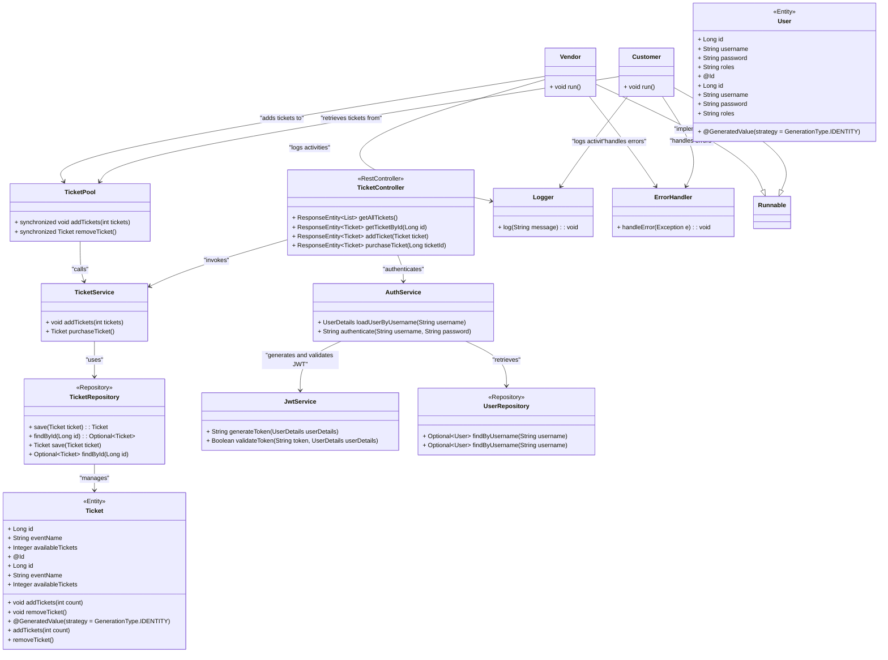

# Ticketing App

## *Project proposal*

```mermaid

classDiagram
    class Ticket {
        <<Entity>>
        + Long id
        + String eventName
        + Integer availableTickets
        + void addTickets(int count)
        + void removeTicket()
    }

    class Vendor {
        + void run()
    }

    class Customer {
        + void run()
    }

    class TicketPool {
        + synchronized void addTickets(int tickets)
        + synchronized Ticket removeTicket()
    }

    class TicketService {
        + void addTickets(int tickets)
        + Ticket purchaseTicket()
    }

    class TicketRepository {
        <<Repository>>
        + save(Ticket ticket): Ticket
        + findById(Long id): Optional~Ticket~
    }

    class TicketController {
        <<RestController>>
        + ResponseEntity~List~ getAllTickets()
        + ResponseEntity~Ticket~ getTicketById(Long id)
        + ResponseEntity~Ticket~ addTicket(Ticket ticket)
        + ResponseEntity~Ticket~ purchaseTicket(Long ticketId)
    }

    class JwtService {
        + String generateToken(UserDetails userDetails)
        + Boolean validateToken(String token, UserDetails userDetails)
    }

    class AuthService {
        + UserDetails loadUserByUsername(String username)
        + String authenticate(String username, String password)
    }

    class User {
        <<Entity>>
        + Long id
        + String username
        + String password
        + String roles
    }

    class UserRepository {
        <<Repository>>
        + Optional~User~ findByUsername(String username)
    }

    class Logger {
        + log(String message): void
    }

    class ErrorHandler {
        + handleError(Exception e): void
    }

%% Relationships between entities and services
    TicketRepository --> Ticket : "manages"
    TicketService --> TicketRepository : "uses"
    TicketPool --> TicketService : "calls"
    TicketController --> TicketService : "invokes"

%% Authentication
    AuthService --> JwtService : "generates and validates JWT"
    AuthService --> UserRepository : "retrieves"
    TicketController --> AuthService : "authenticates"

%% Threads and synchronization
    Vendor --|> Runnable : "implements"
    Customer --|> Runnable : "implements"
    Vendor --> TicketPool : "adds tickets to"
    Customer --> TicketPool : "retrieves tickets from"

%% Logs and errors
    Vendor --> Logger : "logs activities"
    Customer --> Logger : "logs activities"
    Vendor --> ErrorHandler : "handles errors"
    Customer --> ErrorHandler : "handles errors"

%% JPA Relationships
    class Ticket {
        <<Entity>>
        + @Id
        + @GeneratedValue(strategy = GenerationType.IDENTITY)
        + Long id
        + String eventName
        + Integer availableTickets
        + addTickets(int count)
        + removeTicket()
    }

    class TicketRepository {
        <<Repository>>
        + Ticket save(Ticket ticket)
        + Optional~Ticket~ findById(Long id)
    }

    class User {
        <<Entity>>
        + @Id
        + @GeneratedValue(strategy = GenerationType.IDENTITY)
        + Long id
        + String username
        + String password
        + String roles
    }

    class UserRepository {
        <<Repository>>
        + Optional~User~ findByUsername(String username)
    }

```