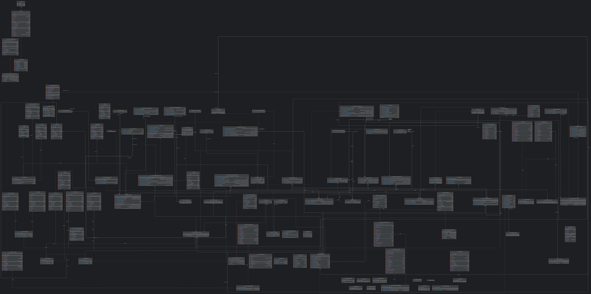

# Real-Time Event Ticketing System


&nbsp;

&nbsp;

&nbsp;

&nbsp;

&nbsp;

```shell
  _____ _    _       _   _             _   ___ ___
 |_   _(_)__| |_____| |_(_)_ _  __ _  /_\ | _ \_ _|
   | | | / _| / / -_)  _| | ' \/ _` |/ _ \|  _/| |
   |_| |_\__|_\_\___|\__|_|_||_\__, /_/ \_\_| |___|  v1.0
                               |___/
   running on Spring Boot 3.3.4
```

[](https://mermaid.live/edit#pako:eNpVUsGO2yAU_BXr7dVxsLGxzVa9NNtTq0q7PVW-vBgco8XGArzdNMq_F5Ooq554M8O8xwAX6I2QwOFkcRmTb8-P3ZwkX62Z_dMskk-73efk8PNHZMN6I74E1RqtpY38B7zJL9K-qV5G7V7fhGe5GKe8seeofcD7HPR4RLcZN7nX6NxBDomQA67aJ4PSmj8QQlIX5r1K_kApvde730r4kZfL-yOkMEk7oRIh1mXr1IEf5SQ74KEUaF876OZr2IerNy_nuQfu7SpTWBeBXh4UhtuY_iefxHZS4ANqF0htUMgAL-DPS7w_5Xzo2Jt5UKeNX60O9Oj94vh-v8nZSflxPWa9mfZOiRGtH99atmcFa7CgktUUK0pFf8zbZijKfBA1yQuE6zWFBeet6zvwhmSkKvKGVoxWtGyqFM7Ac5LlJWN5WbZ0o1nw_DEmpCBZW7O8aauKVbRmpA4GGdN8vz19_AEpWLOexn8Bw7xf0R7x9S-eDK5R)

## *TicketingAPI Class Diagram*

[//]: # ([![]&#40;https://mermaid.ink/img/pako:eNrtHV2TGzXyr0yZl9nDSUGKUGGLgsp-BJYjJJU1UHUsDxNb653LeMY3M16yR-E_dD_h3vhlp2-ppZZGY3uXo4qXZEdqtVqtVqvVarV_ncybBZkcT-ZV0XVnZbFsi9VVvShbMu_Lps5OZlc1r8ueL1Zlnf16VWfZh-Ijr5p6Oc0u-7b0_z_KbEjx9UjWZWuK8JemXYhChiYrFwCiLlYEFJBVUVYCZd-IMopV_MGKP8jmRX3-r01R5a_e_pNSf5S9bZqKFLVodFN0N6d0rLRRWfeijDDwDoN3ycAIt-l2qPwNMO1s9grwjX6ns44BO9zTrAjw02OhRehYRuzE7YNy72WxXpMWMFAU5YpPq2I9a4ScKZYdCUCr_vuOtGd9Y0HwktkrF4cGOtIT4JL0hqybruyb9o6R9fnnF3VP2utiTr74QmC7LuvFyd05G06u5vTVmi2ootpyFFvJ-Pdl13cuqGYl7PaStLflnAT6nLek6InLhttGzfuS9LzY7Sw0SNnbxWpdAeZb5bnDDTUhhyRlvT5t6utyqWlQBTmbP7_vDZtV0lO0naQ0l1MNCgWwEsjzmqlBJlGvYYkAKzb9Dan7cl6wKXzdNrelgH6OVmCNXhZ1saRtYAsxkk3LP1x0sonNDLdx3zZVZS2OQL3Tq2TBNPuB1Ium1Z-nm65vVsQU2PM9dVmjGN6SJZVh2skb-ccbqk1IRzXCG9Ktm7oj57Tn_m4LiVCVW49bJHchR-IL8EviwZklK7VOwWsxPb2NKmFr2wor2V32LlQtf5i93ZQVJptyBCeiGlG6mJaOM1LiEvzcRmE0Wwlc7wMkmgU6ognnQGj8Qd4FhyqkKiQ0ojYf2MfxRs6u3jfvSA1K6OKFNhDTbWpPjU216ABwJSAuh5RJbyAY2XBsA1wfkDAApEWMdx-UF4Q1irwxbRj5Y-BDQilAx0qlZQj48qV2Pbg9eup7mn3zS280PbbzDGv42HCYDcRo8K2aVH0fwq65clJ05PuebuqKE7pAS8OiZFvy83pxSqjioZI6ZeLqyex1066KvieLWbkiJ3cvy3rTk87q6rQqbTvkkSnQ69iAlHXXF_VcLt6-eEcu6vWm7zQrZO-PstuiKheUBbLe0AeYRc2pxYu2WdEecmNHYa1BQ6Rrjt3oJ8UFjHR_6D-2ZW-MDadYc_wX9ilZQ2GEjXF-SydSFNqGIBuY5iIGDMnwqi1avDrNTPOPmin6J11tfVHNyvk70nemdFW8F2WnxbqYUyvDVM2ldfSGUOYRyvo3lPMWPt7sDaHM74iqktyYNd90TZ27I2dTKivwsdOZifYcJhkdYohOw2LZkWar_I6eVqdK5JQA6FajD_3-wdacYWUn2W25Dm1AQ1vW6FNu0jnWISzlXKs45Fvwfk1uq2nHQlccp-cpzXS1tB1jWdXT0-2rTb9FiLG8FFZR7s7qkPPCEYdE707cdk6a_R39Qnv6gPaYfTEVHs95aYDFgZUm2zjrDfX_eKz0uT3EsYApuaeDbQ9GQg8RLIVOIr1KLGk-0i0QQOYMUn8f2WsAh2WzgIDzCoTw_fxICgu2mFNcRTgzgJdG1bg0nDardUX64m1FXmz6TUt8_eJgeN2WDd0K73BrcLNeWAR5sIKm0CBtDxVSlfvchn6qIT4kEfeADPP4ILZ4lwWi1Duaclvo22ZeVGd0VMzcdT5d5SLxKOUCYCVvFs97rFKwV1eqVcwsnO-0bjI2SXfSbJY3EFiZPucD3v_R6icyjNgocHLRoQWGEJi9sCng1uewwnHmWfajrnFPgsaiUHNdLBZRsQmaEwLakuFHTIZn0sa0zFX36COcwJUyT9314nT3LT124n3KhbOg9qxZo2lj-IEu3G1wQhBzSFfk-BphNchyc29v7kf-D-rJuS8px00euy7EWlG5ozILszPI_x00WUSlPIjz9_9Op12c4TN9cZbjjlIPbHj6MCp3WCMxf-YeHMAtU7sOt0-lAvPUy5GDI9jUsUVF4RG6qILEvyFzesoJ6kFdrSeTmez4VBrYuDLkRr_ttjDy-DBLCJ3yIFVBxg2Y9erW92KRuyLvUM4OADOv55O7U1v89K7JOlqqcwze9Ku22awJO1SwIdLBI1urnq2tfQpBifUOI6LKN2dFOU44VQNN26OkhPfn-AkHswc6hH7fLpdWwbhpEroWXbUXZ9IICB8BPCPKPXMEEXsKYpe-IrOkFTHCOVSVoPi64dPQoIEHj2oR_Zg68rhYYWdKDyAPLftpdv6ezDf0zxSX3UGYfnD-HGwVHXxtpC_Le5HEh1qaWkDPyHWxqZATolehjYmbol5URChndhfmnHy-lEO5IVXVYNeNZ2TVYP3ZpcAxjcfiCPyB45cotgd6_n5OOMlfc_J1v265HOYHcpgvSX_TLJ63y82K7dpN_wO7FsvxYo1rmn3d9-uvSbEgbSc-Lvui33TMUJhmP5K3obgTYWJsv7RZrdHm-i-vHevivG2bFgtV-apq3hbVadN28GbLLddTTLfo7kVZiZu3U_1hofyaSrK0QVgD-Znrk4Aw2KDZpoA8b0-20Lddxhy6LCrSuYVMFLqHO6r6FGK0-ES7bIoabTa4O4uav25Fbl83dly2gO27Il1XLNXhkakduSSo3qpJW1Qcm2xDTwtbeGjaZkTXf5g11_CGF4Gfgk6OfIIxTAGwAXoHyEU4AJikmX1BFc2yqGjPzaadm1WmeB6qz825UuOi6goGFIgFo1AFqj0tB8MIlSZaNAKcSw21h3OuTyhMxewCrkekjlFlgpfTTLQ7vSlYwKnj6DZ9W1SaqEa1HfZtMWe-tNOqKFcmyEB8ShHsZiws5vz9umzJAnfCi1lkt9UsgMYaq716H6n-OKoCMPtM33rL7oQiVnIAMEZ6tmVH6lqnMVAmghxWD7d2BIhzRNPzYlPzGPetYNQ0m9FFMRPySag91f-d3GVduawvavqXNS3fNsslxfC8W1Pa1MyAQj05VbMU-5AwCBm3vmnK-nXDl5Yz3QKSIWJ6XJSpa4BZ0b3b_rBVvdnFItDhtKgqZlRQIB2Q4ptl2-ya_2UU01pikmEJGztMwQOIo9QD8TwH5vwf3X18N0F8_9HqHd2U_iT7jxNUZVgGinPDI1geuoW3PWvhiMKRTwl2vBo2kYoO9SBG7h5eaIRCXJ3oQ5wqFXaI1-oJAaGDsfER54YjDOlFvcaAQShiDFDFIDoww8GHantVAUbeNhwEwPZhBUwt8hfNpl4EsXkAKDY6emGwkZoa-mJHUl4gVqnn6bao6HDZ-GnpTz9bha-uDf-gYPC1qujiH7YCw_yeAgjEvgjXumUrY0pNCuYtv8S7l0c547QXpNklDzLI-Pnlp88kwB7fsW-GjXFnVAB8yp2vGWx0XIN-XHbVqVX6yR1DbYZuuWMNWmoEsL0UnvFgaR6wRKeB1yaKtZ3EYhmU0goV5Ue6HwvCnCXBU5RLvgDlwRKpsYdUrjZVwSM-HXeBX5OrIscZ1sniV2u5gLvcidv0dJKDKRTockPm77in-5w5jUg9J4Fw5MVCubfAMcoy0_SE2-HltuQJF5zwq7u7sEHBSeLWapwixROXEwDICWDBqHq7uXNHBo53FmUcmQgjQFFR41CynSljlz-hqbFdqUhVPvQIifEqIcghEBXhRb0HnkLZ51n3oDxmehMFKWHikgQgPiXDIpsojMnr6EDSZmSpL9p-szYqqDHqxa_KmQfP0S3sRPN8va7khCt_YOeLrWkb0yZyZ2AHFZ8X_vHoRHAH-I4tFHmIO6wr7ZmCnaV2A5rnPu9TyOCAIUQIHebqMGv5n5fv2B0C3cOadtYsitAp0r6oZBEK0gsu7ZDXdHRserpAa75cTdfb7MamONoqdPO51Tf8M5cETGKAkoPFuaez7Iui8BWS55eculZJyO1-oOm9bykctxj2WHd_ySn9RuwzWGwrT_g4DJcyZfw6_YauewKc07iAnHTRQEBr9IF7vhQsQY66nINBPFYRjN2JnH1klQWMcwMxGXBAt9tc9qDOopYPjAMZx5pk85HxtVnDnZGuP69v1VDlZ25vpYLCn372ts_ZjXzM5UiZW56Ho1GnEpjLknddzoJFebWc3JM78fmd8b8EQz35hAtweJmL4M13wHG6aVuq3kWtuEYchcbhIgyTtMv0XIBCJwLSlaLA2zeOoUsId2RNinlf3hLQxntmwuDKRWVD7eDFGP-yy3MFDgY7OuPHR-iPx5kmJqdwklhJaDakN8D_A04pR6EmS0Jg3FdVI-dSNXPmyZvNPybLTnC80SkNjCnAImQSoTvGLTceRGHIydAeWmwg2T2MqpBGiwp0SwNnisgedI4Dw_j5mTWw4QbCRhlFvl0-PIALw_84NcgUGB-iXYavJX_B-B7FOhCWDSTnQdMiDGsnhC3Q9nDLoQGitwSL-Udgo_CAubKxIew5RglKerL2LR1RJ3dDuk-DHfp1sSQ6ssbaDBnybQBFntgI6YrZ0VgTZGjxwz9ugdytyVAsWcBkkFZCaJ34yJ63bXHHMUq9tt3GDgyw26xwaB_RdO4bNzH-2UdhtDIw5ml2-HKhwKeo_MZNy78mVhw6WEjDem050PTU4tWWSir90wL3awq_HXAF0MVbdjegSLs_tYOPDsbqiJ0oyHvf-4wfmDTVqeeuKLibuacEj7nQxBK81M7Q8DD3e2jXeHIIMBjNTnZaU8zj2VwUa_hHPBEAu0yNv8eywg_4Ra4XnzCQ2DBq6oKshyYEgRFu3YvvkzRi9LuSaLAC4EDU4A2_jedrnx6zRWDTV21Rs1ab_oaH8Gx52h32ZwnvdU2GJjDxTiCEVaTFoFzkwuXgsNWJi_BqYTCEV-1FQHgQPOyBsQyp09zKHeHzIFVMBKsYDoRgUL6HA5a691kxd4d1tWXtRiBpkuM9kFksgeeM7l48zijqcbAagpaC2oS2jmdMltk8CGUGsTUG8gQskKYiMe3rPdvq3urSNEJOgE3GlAwoSPTdvdU6GL2V9DrV6NZYCpZ9GJjsvxnloYlqNzyAi_EMHpVMCTwkWdxlfx5Z7HbwJb_iC-RuHczfwTpxl9TgGYRrMAejPQRDGAZ5YkfDOGqBWZIyXhEjyTbrneJAJtYkMhIHlUSt0GWKSHm1nJJoWYKOUkzxjEU7rpzdHijvm2ZZDN_f2NzyHETeiVprD9AFOeRrWrrrsfsBOhEPY1QflO1INjs_lR3OvlCCOwyD7f4PJLkD7B7IeBecDSy7BX4gwvPlHSS7S9p1AfLI2wp7Dyfd8_akYK69SGq-SBY-b_JCKxMFyffJA7Mksk1SQhavJ-tKVlzu-3KIRgW5iVkwvL7RagF0O9MpA7EgcViDi3oMneLl7NDwQ08LY8LgKVxYt7-qsE30VG3hq4OUjJmeXhjKkJOmLQ57ov_TaQsuqzERuYA_3BEThIs6j6VxdLKu_LEJOsChzBsMPB0EquFRwWdI3-RIOluMcTE0OdYAQaNxsDyxPIvv5fyGyhGaVTektMws42SGOZaanFDNhH_A8VC6P3rhNfUOT1TZw51I5QrRneAafrtFk6DwOwG5uvJ4vhR5Dw9AhFbHCHec0KE9OJqtZHi3AFG9HjhGF_JeL7xp2SG5Q_JqS9aoTmQ6CEsBwrC_UcgSJSlkNSRmg4jZD17A8w7BiJFO2DHXpztB0uzjegwmHp2KxFM_iJCM5uoua-igkniPIpYu5IdWCfciq9hOHN5-c-1DUDuYB2K25SPjcUB--cnCpH_6yaHt3n1-ohvfwB_0-wkwF68zXPCmwhquDti3Zo_HPusZ60IU-XrEVx7onfoDEvwjeQsdKLogtxOc0kZMzigdXc4-xDtYRrTeva9q_YNt2aNHX2T6mkNWSNnNHj-mdeIH8Y6z3_8jhvH7f4NQDMUQoOoKgbPn4mry8dUk-xuj7mpSOL9GxqrcXyhDcFiUKcELQoWf6zqE6h_qAhS2kDjHsU6bhX7SKs69UCufO2qAmjXWiJOwdDYC9GdYBkdhp9jfZSBzJ6s3q3IzfQ8SEcylkkiRwGK8vrsM5BYoO1YB1Z-LR-VEEIsx-itUflOZngdvC39gyG2s6NmDc3pI9vj_aRK6sFIrv0ucguRFOEzC0II0PwUjZRf72RXYK_JzFjuI7xCWGO_sBeYqbudXAuCKDIwEhfWFPg4u7oTxFkGNPvd_GsBmF5wqBBmkwefQ7go-mK8cdmmyZ-_R_OIstTXKPJgh1OYfrEnFmyJ6gXHtzV1AyKbzJMNfwEmYbkMeCqOUkUoXOyr48ucIYuOLtIsuGz9H5x6KJhGZl9PXl6cI_8NrMy6Kfjs3E1Qqh8bJoZP5MXkZOO0O1-nQfhVK65ZMuZt_SewfgZRAV7WTwsPthtEiKZA94dTVSN4MaHY6CS5YlZv0wmBBrHvUkIJ8x1pDC5oiuUywf8NkhDfPwc7TVvNw16EdKbWltxklU56-D4VpccUzdQxpsuLtLjaxdkBSrKvQmWCohXdpNZLNu-5hiYhjxxQsLwVcvlY2Cb50rW_e_PAbj4tUsFplgXV4GyPgxsuIyir9PKmhLk36v3in4zaJKMmdk6-Js9wpCxEwYmpS7K8ogtvILRsqtR7qbpfd2W04nvPBbocFvdt1a7df3w9LFoQUmduSoHz97sEFHpXAZt4L-OTp8VqOm594x733wI1V-s_ehvCkyL73pBYqNsyVwJUaVmFjg5Nhv5HHOBFowZ9rh-B9tZDUTXCh9y4nINORMQ6gcliPvshMGRCccv68By5K9gqFffPnKBLC-FSMIew8hkgWdqfdOFGPdTqkTmJt46ZPrOWwrWAFp1uefkyu3HDr8bzZa-fCu4esMLae62eLhS0mC0cMyThuJJMzJDbJiHY1R9EQP8HdgJ2MtAECNuSwHdna32-jUQdwnvyksTujGj3lYXMxarSk49nPnEsY-qDYJFwhIoDypUQiXAjlvjM1wFaUlwgDQ1wzrJpMJ_TItCrKxeR4wu-I2a5KVuRqckz_rEr2a16Tq_o3Clhs-ubyrp5Pjvt2Q6Z0P9wsbybH10XV0S8RM3JWFsu2WCmQdVH_o2lWGogsGIEvmwWh3bG0kxMOMzn-dfJ-cvzk6cePnzz7-Nmnn3307NNnz54-ezqd3E2OP3n6-LMnTz5-8sknTz_69Mlnz578Np38m2P96PHT3_4HfqnM8Q?type=png&#41;]&#40;https://mermaid.live/edit#pako:eNrtHV2TGzXyr0yZl9nDSUGKUGGLgsp-BJYjJJU1UHUsDxNb653LeMY3M16yR-E_dD_h3vhlp2-ppZZGY3uXo4qXZEdqtVqtVqvVarV_ncybBZkcT-ZV0XVnZbFsi9VVvShbMu_Lps5OZlc1r8ueL1Zlnf16VWfZh-Ijr5p6Oc0u-7b0_z_KbEjx9UjWZWuK8JemXYhChiYrFwCiLlYEFJBVUVYCZd-IMopV_MGKP8jmRX3-r01R5a_e_pNSf5S9bZqKFLVodFN0N6d0rLRRWfeijDDwDoN3ycAIt-l2qPwNMO1s9grwjX6ns44BO9zTrAjw02OhRehYRuzE7YNy72WxXpMWMFAU5YpPq2I9a4ScKZYdCUCr_vuOtGd9Y0HwktkrF4cGOtIT4JL0hqybruyb9o6R9fnnF3VP2utiTr74QmC7LuvFyd05G06u5vTVmi2ootpyFFvJ-Pdl13cuqGYl7PaStLflnAT6nLek6InLhttGzfuS9LzY7Sw0SNnbxWpdAeZb5bnDDTUhhyRlvT5t6utyqWlQBTmbP7_vDZtV0lO0naQ0l1MNCgWwEsjzmqlBJlGvYYkAKzb9Dan7cl6wKXzdNrelgH6OVmCNXhZ1saRtYAsxkk3LP1x0sonNDLdx3zZVZS2OQL3Tq2TBNPuB1Ium1Z-nm65vVsQU2PM9dVmjGN6SJZVh2skb-ccbqk1IRzXCG9Ktm7oj57Tn_m4LiVCVW49bJHchR-IL8EviwZklK7VOwWsxPb2NKmFr2wor2V32LlQtf5i93ZQVJptyBCeiGlG6mJaOM1LiEvzcRmE0Wwlc7wMkmgU6ognnQGj8Qd4FhyqkKiQ0ojYf2MfxRs6u3jfvSA1K6OKFNhDTbWpPjU216ABwJSAuh5RJbyAY2XBsA1wfkDAApEWMdx-UF4Q1irwxbRj5Y-BDQilAx0qlZQj48qV2Pbg9eup7mn3zS280PbbzDGv42HCYDcRo8K2aVH0fwq65clJ05PuebuqKE7pAS8OiZFvy83pxSqjioZI6ZeLqyex1066KvieLWbkiJ3cvy3rTk87q6rQqbTvkkSnQ69iAlHXXF_VcLt6-eEcu6vWm7zQrZO-PstuiKheUBbLe0AeYRc2pxYu2WdEecmNHYa1BQ6Rrjt3oJ8UFjHR_6D-2ZW-MDadYc_wX9ilZQ2GEjXF-SydSFNqGIBuY5iIGDMnwqi1avDrNTPOPmin6J11tfVHNyvk70nemdFW8F2WnxbqYUyvDVM2ldfSGUOYRyvo3lPMWPt7sDaHM74iqktyYNd90TZ27I2dTKivwsdOZifYcJhkdYohOw2LZkWar_I6eVqdK5JQA6FajD_3-wdacYWUn2W25Dm1AQ1vW6FNu0jnWISzlXKs45Fvwfk1uq2nHQlccp-cpzXS1tB1jWdXT0-2rTb9FiLG8FFZR7s7qkPPCEYdE707cdk6a_R39Qnv6gPaYfTEVHs95aYDFgZUm2zjrDfX_eKz0uT3EsYApuaeDbQ9GQg8RLIVOIr1KLGk-0i0QQOYMUn8f2WsAh2WzgIDzCoTw_fxICgu2mFNcRTgzgJdG1bg0nDardUX64m1FXmz6TUt8_eJgeN2WDd0K73BrcLNeWAR5sIKm0CBtDxVSlfvchn6qIT4kEfeADPP4ILZ4lwWi1Duaclvo22ZeVGd0VMzcdT5d5SLxKOUCYCVvFs97rFKwV1eqVcwsnO-0bjI2SXfSbJY3EFiZPucD3v_R6icyjNgocHLRoQWGEJi9sCng1uewwnHmWfajrnFPgsaiUHNdLBZRsQmaEwLakuFHTIZn0sa0zFX36COcwJUyT9314nT3LT124n3KhbOg9qxZo2lj-IEu3G1wQhBzSFfk-BphNchyc29v7kf-D-rJuS8px00euy7EWlG5ozILszPI_x00WUSlPIjz9_9Op12c4TN9cZbjjlIPbHj6MCp3WCMxf-YeHMAtU7sOt0-lAvPUy5GDI9jUsUVF4RG6qILEvyFzesoJ6kFdrSeTmez4VBrYuDLkRr_ttjDy-DBLCJ3yIFVBxg2Y9erW92KRuyLvUM4OADOv55O7U1v89K7JOlqqcwze9Ku22awJO1SwIdLBI1urnq2tfQpBifUOI6LKN2dFOU44VQNN26OkhPfn-AkHswc6hH7fLpdWwbhpEroWXbUXZ9IICB8BPCPKPXMEEXsKYpe-IrOkFTHCOVSVoPi64dPQoIEHj2oR_Zg68rhYYWdKDyAPLftpdv6ezDf0zxSX3UGYfnD-HGwVHXxtpC_Le5HEh1qaWkDPyHWxqZATolehjYmbol5URChndhfmnHy-lEO5IVXVYNeNZ2TVYP3ZpcAxjcfiCPyB45cotgd6_n5OOMlfc_J1v265HOYHcpgvSX_TLJ63y82K7dpN_wO7FsvxYo1rmn3d9-uvSbEgbSc-Lvui33TMUJhmP5K3obgTYWJsv7RZrdHm-i-vHevivG2bFgtV-apq3hbVadN28GbLLddTTLfo7kVZiZu3U_1hofyaSrK0QVgD-Znrk4Aw2KDZpoA8b0-20Lddxhy6LCrSuYVMFLqHO6r6FGK0-ES7bIoabTa4O4uav25Fbl83dly2gO27Il1XLNXhkakduSSo3qpJW1Qcm2xDTwtbeGjaZkTXf5g11_CGF4Gfgk6OfIIxTAGwAXoHyEU4AJikmX1BFc2yqGjPzaadm1WmeB6qz825UuOi6goGFIgFo1AFqj0tB8MIlSZaNAKcSw21h3OuTyhMxewCrkekjlFlgpfTTLQ7vSlYwKnj6DZ9W1SaqEa1HfZtMWe-tNOqKFcmyEB8ShHsZiws5vz9umzJAnfCi1lkt9UsgMYaq716H6n-OKoCMPtM33rL7oQiVnIAMEZ6tmVH6lqnMVAmghxWD7d2BIhzRNPzYlPzGPetYNQ0m9FFMRPySag91f-d3GVduawvavqXNS3fNsslxfC8W1Pa1MyAQj05VbMU-5AwCBm3vmnK-nXDl5Yz3QKSIWJ6XJSpa4BZ0b3b_rBVvdnFItDhtKgqZlRQIB2Q4ptl2-ya_2UU01pikmEJGztMwQOIo9QD8TwH5vwf3X18N0F8_9HqHd2U_iT7jxNUZVgGinPDI1geuoW3PWvhiMKRTwl2vBo2kYoO9SBG7h5eaIRCXJ3oQ5wqFXaI1-oJAaGDsfER54YjDOlFvcaAQShiDFDFIDoww8GHantVAUbeNhwEwPZhBUwt8hfNpl4EsXkAKDY6emGwkZoa-mJHUl4gVqnn6bao6HDZ-GnpTz9bha-uDf-gYPC1qujiH7YCw_yeAgjEvgjXumUrY0pNCuYtv8S7l0c547QXpNklDzLI-Pnlp88kwB7fsW-GjXFnVAB8yp2vGWx0XIN-XHbVqVX6yR1DbYZuuWMNWmoEsL0UnvFgaR6wRKeB1yaKtZ3EYhmU0goV5Ue6HwvCnCXBU5RLvgDlwRKpsYdUrjZVwSM-HXeBX5OrIscZ1sniV2u5gLvcidv0dJKDKRTockPm77in-5w5jUg9J4Fw5MVCubfAMcoy0_SE2-HltuQJF5zwq7u7sEHBSeLWapwixROXEwDICWDBqHq7uXNHBo53FmUcmQgjQFFR41CynSljlz-hqbFdqUhVPvQIifEqIcghEBXhRb0HnkLZ51n3oDxmehMFKWHikgQgPiXDIpsojMnr6EDSZmSpL9p-szYqqDHqxa_KmQfP0S3sRPN8va7khCt_YOeLrWkb0yZyZ2AHFZ8X_vHoRHAH-I4tFHmIO6wr7ZmCnaV2A5rnPu9TyOCAIUQIHebqMGv5n5fv2B0C3cOadtYsitAp0r6oZBEK0gsu7ZDXdHRserpAa75cTdfb7MamONoqdPO51Tf8M5cETGKAkoPFuaez7Iui8BWS55eculZJyO1-oOm9bykctxj2WHd_ySn9RuwzWGwrT_g4DJcyZfw6_YauewKc07iAnHTRQEBr9IF7vhQsQY66nINBPFYRjN2JnH1klQWMcwMxGXBAt9tc9qDOopYPjAMZx5pk85HxtVnDnZGuP69v1VDlZ25vpYLCn372ts_ZjXzM5UiZW56Ho1GnEpjLknddzoJFebWc3JM78fmd8b8EQz35hAtweJmL4M13wHG6aVuq3kWtuEYchcbhIgyTtMv0XIBCJwLSlaLA2zeOoUsId2RNinlf3hLQxntmwuDKRWVD7eDFGP-yy3MFDgY7OuPHR-iPx5kmJqdwklhJaDakN8D_A04pR6EmS0Jg3FdVI-dSNXPmyZvNPybLTnC80SkNjCnAImQSoTvGLTceRGHIydAeWmwg2T2MqpBGiwp0SwNnisgedI4Dw_j5mTWw4QbCRhlFvl0-PIALw_84NcgUGB-iXYavJX_B-B7FOhCWDSTnQdMiDGsnhC3Q9nDLoQGitwSL-Udgo_CAubKxIew5RglKerL2LR1RJ3dDuk-DHfp1sSQ6ssbaDBnybQBFntgI6YrZ0VgTZGjxwz9ugdytyVAsWcBkkFZCaJ34yJ63bXHHMUq9tt3GDgyw26xwaB_RdO4bNzH-2UdhtDIw5ml2-HKhwKeo_MZNy78mVhw6WEjDem050PTU4tWWSir90wL3awq_HXAF0MVbdjegSLs_tYOPDsbqiJ0oyHvf-4wfmDTVqeeuKLibuacEj7nQxBK81M7Q8DD3e2jXeHIIMBjNTnZaU8zj2VwUa_hHPBEAu0yNv8eywg_4Ra4XnzCQ2DBq6oKshyYEgRFu3YvvkzRi9LuSaLAC4EDU4A2_jedrnx6zRWDTV21Rs1ab_oaH8Gx52h32ZwnvdU2GJjDxTiCEVaTFoFzkwuXgsNWJi_BqYTCEV-1FQHgQPOyBsQyp09zKHeHzIFVMBKsYDoRgUL6HA5a691kxd4d1tWXtRiBpkuM9kFksgeeM7l48zijqcbAagpaC2oS2jmdMltk8CGUGsTUG8gQskKYiMe3rPdvq3urSNEJOgE3GlAwoSPTdvdU6GL2V9DrV6NZYCpZ9GJjsvxnloYlqNzyAi_EMHpVMCTwkWdxlfx5Z7HbwJb_iC-RuHczfwTpxl9TgGYRrMAejPQRDGAZ5YkfDOGqBWZIyXhEjyTbrneJAJtYkMhIHlUSt0GWKSHm1nJJoWYKOUkzxjEU7rpzdHijvm2ZZDN_f2NzyHETeiVprD9AFOeRrWrrrsfsBOhEPY1QflO1INjs_lR3OvlCCOwyD7f4PJLkD7B7IeBecDSy7BX4gwvPlHSS7S9p1AfLI2wp7Dyfd8_akYK69SGq-SBY-b_JCKxMFyffJA7Mksk1SQhavJ-tKVlzu-3KIRgW5iVkwvL7RagF0O9MpA7EgcViDi3oMneLl7NDwQ08LY8LgKVxYt7-qsE30VG3hq4OUjJmeXhjKkJOmLQ57ov_TaQsuqzERuYA_3BEThIs6j6VxdLKu_LEJOsChzBsMPB0EquFRwWdI3-RIOluMcTE0OdYAQaNxsDyxPIvv5fyGyhGaVTektMws42SGOZaanFDNhH_A8VC6P3rhNfUOT1TZw51I5QrRneAafrtFk6DwOwG5uvJ4vhR5Dw9AhFbHCHec0KE9OJqtZHi3AFG9HjhGF_JeL7xp2SG5Q_JqS9aoTmQ6CEsBwrC_UcgSJSlkNSRmg4jZD17A8w7BiJFO2DHXpztB0uzjegwmHp2KxFM_iJCM5uoua-igkniPIpYu5IdWCfciq9hOHN5-c-1DUDuYB2K25SPjcUB--cnCpH_6yaHt3n1-ohvfwB_0-wkwF68zXPCmwhquDti3Zo_HPusZ60IU-XrEVx7onfoDEvwjeQsdKLogtxOc0kZMzigdXc4-xDtYRrTeva9q_YNt2aNHX2T6mkNWSNnNHj-mdeIH8Y6z3_8jhvH7f4NQDMUQoOoKgbPn4mry8dUk-xuj7mpSOL9GxqrcXyhDcFiUKcELQoWf6zqE6h_qAhS2kDjHsU6bhX7SKs69UCufO2qAmjXWiJOwdDYC9GdYBkdhp9jfZSBzJ6s3q3IzfQ8SEcylkkiRwGK8vrsM5BYoO1YB1Z-LR-VEEIsx-itUflOZngdvC39gyG2s6NmDc3pI9vj_aRK6sFIrv0ucguRFOEzC0II0PwUjZRf72RXYK_JzFjuI7xCWGO_sBeYqbudXAuCKDIwEhfWFPg4u7oTxFkGNPvd_GsBmF5wqBBmkwefQ7go-mK8cdmmyZ-_R_OIstTXKPJgh1OYfrEnFmyJ6gXHtzV1AyKbzJMNfwEmYbkMeCqOUkUoXOyr48ucIYuOLtIsuGz9H5x6KJhGZl9PXl6cI_8NrMy6Kfjs3E1Qqh8bJoZP5MXkZOO0O1-nQfhVK65ZMuZt_SewfgZRAV7WTwsPthtEiKZA94dTVSN4MaHY6CS5YlZv0wmBBrHvUkIJ8x1pDC5oiuUywf8NkhDfPwc7TVvNw16EdKbWltxklU56-D4VpccUzdQxpsuLtLjaxdkBSrKvQmWCohXdpNZLNu-5hiYhjxxQsLwVcvlY2Cb50rW_e_PAbj4tUsFplgXV4GyPgxsuIyir9PKmhLk36v3in4zaJKMmdk6-Js9wpCxEwYmpS7K8ogtvILRsqtR7qbpfd2W04nvPBbocFvdt1a7df3w9LFoQUmduSoHz97sEFHpXAZt4L-OTp8VqOm594x733wI1V-s_ehvCkyL73pBYqNsyVwJUaVmFjg5Nhv5HHOBFowZ9rh-B9tZDUTXCh9y4nINORMQ6gcliPvshMGRCccv68By5K9gqFffPnKBLC-FSMIew8hkgWdqfdOFGPdTqkTmJt46ZPrOWwrWAFp1uefkyu3HDr8bzZa-fCu4esMLae62eLhS0mC0cMyThuJJMzJDbJiHY1R9EQP8HdgJ2MtAECNuSwHdna32-jUQdwnvyksTujGj3lYXMxarSk49nPnEsY-qDYJFwhIoDypUQiXAjlvjM1wFaUlwgDQ1wzrJpMJ_TItCrKxeR4wu-I2a5KVuRqckz_rEr2a16Tq_o3Clhs-ubyrp5Pjvt2Q6Z0P9wsbybH10XV0S8RM3JWFsu2WCmQdVH_o2lWGogsGIEvmwWh3bG0kxMOMzn-dfJ-cvzk6cePnzz7-Nmnn3307NNnz54-ezqd3E2OP3n6-LMnTz5-8sknTz_69Mlnz578Np38m2P96PHT3_4HfqnM8Q&#41;)
[](https://github.com/anuja-rahul/ticketingApp/blob/main/diagrams/ticketingappIntellij.png)


## JWT Authentication

[](https://mermaid.live/edit#pako:eNqFVFFv2jAQ_iuWnzaNQkJIAD9UmsqqblqlrrBNmngx9kGsBjuzna6s4r_PTgyFJtvygMjdfffdZ3-5Z8wUB0ywgZ8VSAYzQTeabpcSuaek2gomSiotuioESNuOf_q-eF_Z_FoUFnRneg76UTBo574a0DOwVBTmrzVzYJUWdtfOzIQpqWU5aA8uoGO2KyWtVkXRNdiMWrqixlE2uUbfxeXluzNFxE0gObpZLO7QvT8jE3jOqhzsFeoqB_bgi9BCPUDgaH5pYdGtMEbIDVIafZSPtBDc1zb5dnfXvhmPNIOMogS9uVZ6JTgH-baBQWEAfftfq0ZfOG7S1FMLrycNwFDnUe3LIuizory-RRQyL-B2uVdxccrdDTxhDYDTY230eeTpiXbKPDjHEZW1xEPAuwKe7I0q-KGNfw7pLtp5xRgYs5T_4Gv5kaA7asyxLwq8Ly1aCN_mxbMEuSv-RTU_N15t1mNRzRysTNCXCvTuxNpHphCptZ0y3IOttKzznd19fYewALsHUyp5RtSS9Nq7wyhCb8J5HpwruT9Z3MNb0FsquNtHzz61xDaHLSwxcX851Q9LvJR7V0crq-Y7yTCxuoIeruobDrvrPPiBC6s0Jmvqvo8eLpxlwb0-Y7sr_eLbCGNdR6bkWmx8vNKFC-fWloYMBj7d3wibV6s-U9uBETx3WyR_nGaDbJhN6DCBbJzQNEk4W8XTyXo4itd8HMVDivf7HnbLxnd9wmQS9aN0GE-SNEvSZDRJe3iHSRz141GWxaPRNPHhzGF-K-VURP3pOIsn0zTN0mScRWMHgFrNbbOz69Xdw1pVm_wo0PH9qOH1-_4PXujrmQ)

## 🎫 Real-Time Event Ticketing System Checklist

- [x] **Accept User Prompts at Launch**
  Prompt users for configuration options before application startup.

- [x] **Error Handling and Input Validation**
  Ensure robust error handling and validation for all user inputs.

- [ ] **Start and Stop Functionality via CLI Buttons**
  Implement CLI commands to easily start and stop the system.

- [ ] **Default Configuration Feature**
  Provide a fallback configuration to use when custom settings are not specified.

- [ ] **Dynamic Configuration Feature (Optional)**
  Allow for real-time, customizable configurations during runtime.

- [ ] **Documentation for CLI Usage and Config Options**
  Provide clear documentation for all available CLI commands and configuration options.

- [ ] **Javadoc for All Classes and Methods**
  Ensure comprehensive Javadoc documentation is provided for maintainability.

  ## 🚀 Getting Started

  ### Prerequisites

  - Java 21 or higher
  - Maven 3.6.3 or higher
  - PostgreSQL 13 or higher

  ### Installation

  1. Clone the repository:

      ```shell
      git clone https://github.com/anuja-rahul/ticketingApp.git

      cd ticketingApp
      ```

  2. Configure the database in application.properties:

      ```properties
      spring.datasource.url=jdbc:postgresql://localhost:5432/ticketingapp
      spring.datasource.username=yourUsername
      spring.datasource.password=yourPassword
      ```

  3. Build the project:

      ```shell
      mvn clean install
      ```

  4. Run the application:

      ```shell
      mvn spring-boot:run
      ```

  ### Running Tests

  To run the tests, use the following command:

  ```shell
  mvn test
  ```

  ### Usage

  After starting the application, you can access the API at `http://localhost:8080/api`.

  ## 📄 License

  This project is licensed under the MIT License - see the [LICENSE](LICENSE) file for details.

