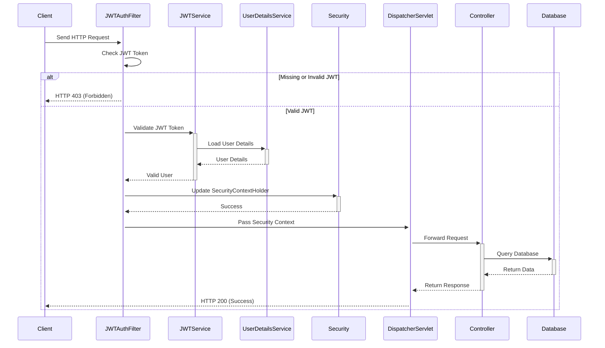

# Real-Time Event Ticketing System

```shell
  _____ _    _       _   _             _   ___ ___
 |_   _(_)__| |_____| |_(_)_ _  __ _  /_\ | _ \_ _|
   | | | / _| / / -_)  _| | ' \/ _` |/ _ \|  _/| |
   |_| |_\__|_\_\___|\__|_|_||_\__, /_/ \_\_| |___|  v1.0
                               |___/
   running on Spring Boot 3.3.4
```


## *Project proposal*


## JWT Authentication



## Real-Time Event Ticketing System Checklist

## Entities
- [ ] **Ticket**
    - Properties:
        - Long id
        - String eventName
        - Integer availableTickets
    - Methods:
        - void addTickets(int count)
        - void removeTicket()

- [ ] **CustomerAccount** (renamed from User)
    - Properties:
        - Long id
        - String username
        - String password
        - String role (e.g., "VENDOR" or "CUSTOMER")

## Repositories
- [ ] **TicketRepository**
    - Methods:
        - Ticket save(Ticket ticket)
        - Optional~Ticket~ findById(Long id)

- [ ] **CustomerAccountRepository** (renamed from UserRepository)
    - Methods:
        - Optional~CustomerAccount~ findByUsername(String username)

## Services
- [ ] **TicketService**
    - Methods:
        - void addTickets(int tickets)
        - Ticket purchaseTicket()

- [ ] **AuthService**
    - Methods:
        - UserDetails loadUserByUsername(String username)
        - String authenticate(String username, String password)

- [ ] **JwtService**
    - Methods:
        - String generateToken(UserDetails userDetails)
        - Boolean validateToken(String token, UserDetails userDetails)

## Controllers
- [ ] **TicketController**
    - Methods:
        - ResponseEntity~List~ getAllTickets()
        - ResponseEntity~Ticket~ getTicketById(Long id)
        - ResponseEntity~Ticket~ addTicket(Ticket ticket)
        - ResponseEntity~Ticket~ purchaseTicket(Long ticketId)

## Utility Classes
- [ ] **TicketPool**
    - Methods:
        - synchronized void addTickets(int tickets)
        - synchronized Ticket removeTicket()

- [x] **Logger**
    - Custom annotation:
        - [x] MethodLogger(String message)
        - [ ] ConstructorLogger(String message)

- [ ] **ErrorHandler**
    - Methods:
        - void handleError(Exception e)

## Thread Classes
- [ ] **Vendor**
    - Methods:
        - void run()

- [ ] **Customer**
    - Methods:
        - void run()
